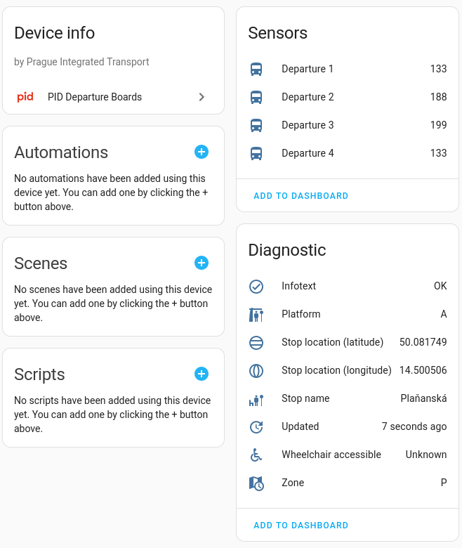

# PID Departure Board integration

This custom component provides a departures board information for the selected stops of the Prague Integrated Transport [PID](http://www.pid.cz/). 

Multiple departure boards can be configured.

## About this project

This is an independent fork of [dvejsada/PID_integration](https://github.com/dvejsada/PID_integration), started because the original project's development had stalled and several improvements were wanted. On top of the original's core departure-board functionality, this fork adds:

- Live GTFS-based stop search in the config flow (no more bundled, easily-outdated stop list)
- Extra Golemio API query options (mode, ordering, filtering, air-condition info, headsign enrichment)
- Live GPS tracking of the next incoming vehicle
- A fully rewritten, animated Lovelace card bundled with the integration (no external card dependency), supporting one or several stops per card, merged or grouped
- A second card for service announcements, optionally translated out of Czech via any Home Assistant conversation agent (e.g. Gemini)
- Modernized Home Assistant integration internals (`DataUpdateCoordinator`, options flow, reauth flow)

This repository has its own commit history, independent of the original project.

| Device page                                     |                  Sensor attributes                   |
|:------------------------------------------------|:----------------------------------------------------:|
|  |  |

## Installation

### Using [HACS](https://hacs.xyz/)

Add this repository to HACS as a custom repository (category: Integration), then install **PID Departure Boards (Dev)** from there.

### Manual

To install this integration manually you have to download the `pid_departures_dev` folder into your `config/custom_components` folder.

## Configuration

### Using UI

From the Home Assistant front page go to **Configuration** and then select **Integrations** from the list.

Use the "plus" button in the bottom right to add a new integration called **PID Departure boards**.

Setup is two steps:

1. Enter your API key (if you don't have one, get it here: https://api.golemio.cz/api-keys/auth/sign-up). It is only required once - for additional departure boards it is prefilled.
2. Pick a stop from the list (type to search - the list is fetched live from Golemio, not bundled in the integration, so it's always current), the number of departures to display, the number of calendar events to create, and optionally enable live tracking of the next vehicle's position.

The success dialog will appear or an error will be displayed in the popup.

### Changing options

The number of departures, number of calendar events, the walking-time offset, and vehicle tracking can be changed at any time via the **Configure** button on the integration entry — there is no need to delete and re-add the board. The same dialog also exposes advanced Golemio API query options (mode, ordering, filtering, skipping canceled/at-stop trips, air-condition info, headsign enrichment) for anyone who wants to fine-tune the raw departure query; the defaults match the previous behaviour.

If your Golemio API key stops working (e.g. it expired), Home Assistant will prompt you to re-authenticate; just enter a new key and the board reloads automatically.

### Translating service announcements

Golemio's service announcements ("infotexts") are Czech-only. If you have a conversation agent configured in Home Assistant (e.g. Google Generative AI / Gemini, used for Assist), you can point the integration at it under **Configure → advanced options**: pick the agent and the language to translate into. Translated text is cached in memory (per unique announcement) so the agent isn't re-queried every 60-second refresh - only when an announcement actually changes.

### Deliberately not implemented

A few more Golemio PID endpoints exist (`/v3/pid/infotexts` city-wide, `/v3-v4/pid/transferboards`, `/v3/pid/departurepresets`). They were left out as low value for a per-stop departure board (city-wide, experimental/train-only, or ROPID-internal, respectively) - open an issue if you have a use case for one of them.

## Dashboard

The integration ships its own Lovelace card - **PID Departures Card** - with no external dependency (it replaces the previous Flex-table-card example). Add it from the card picker ("+ Add card" → search "PID Departures"), or with YAML:

```yaml
type: custom:pid-departures-card
device_ids:
  - <first departure board's device id>
  - <second departure board's device id>  # optional - add as many as you like
sort_by: time  # "time" merges all stops into one chronological list; "stop" groups them into sections
rows: 6  # total rows when sort_by is "time"; rows per stop when sort_by is "stop"
show_platform: true
show_zone: true
show_delay: true
show_air_condition: true
show_wheelchair: true
show_arrival_time: false
show_alerts: true
show_vehicle_tracking: true
```

The visual editor lets you tick one or more devices and toggle each of these without touching YAML. With a single device the card looks and behaves like a normal single-stop board; with several, `sort_by` decides whether they're merged into one time-ordered table (each row tagged with its stop) or shown as separate sections. The card shows a live, second-by-second countdown to each departure, colour-coded delays, service alerts (aggregated across all shown stops), and (if enabled) a pulsing indicator per stop while its next vehicle is being tracked.

A second card - **PID Alerts Card** (`custom:pid-alerts-card`) - shows just the service announcements for one or more stops, full-size instead of tucked into a collapsible bar, with the translated text (if configured, see above) as the primary line and the Czech original underneath (toggle `show_original: false` to hide it):

```yaml
type: custom:pid-alerts-card
device_ids:
  - <departure board's device id>
show_original: true
```

Both cards are localized (English/Czech so far) and follow your Home Assistant UI language automatically.
